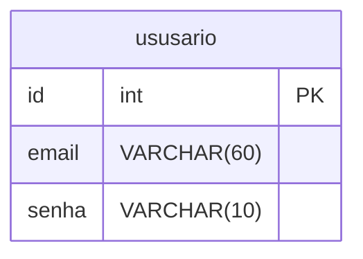

# Mini sistema: Gerenciamento de Alunos.

## CRUD Utilizando HTML + PHP POSTGRESQL

### Objetivos:
1. Cadastrar Aluno:
- Receber nome, Turma, Nascimento, Ativo.

2. Excluir Aluno:
- Excluir um aluno a partir do ID

3. Relatório:
- Listar todos os alunos cadastrados no sistema

4. Consultar Aluno:
- Consulta de um aluno especifico a partir do ID

5. Atualizar Aluno:
- Atualizar aluno a partir do ID

### Sistema de login
RF Descriação 
1. Tabela usuários

2. Cadastra usuários

3. Criar login

4. Verificar se os usuários são válidos em todas as páginas